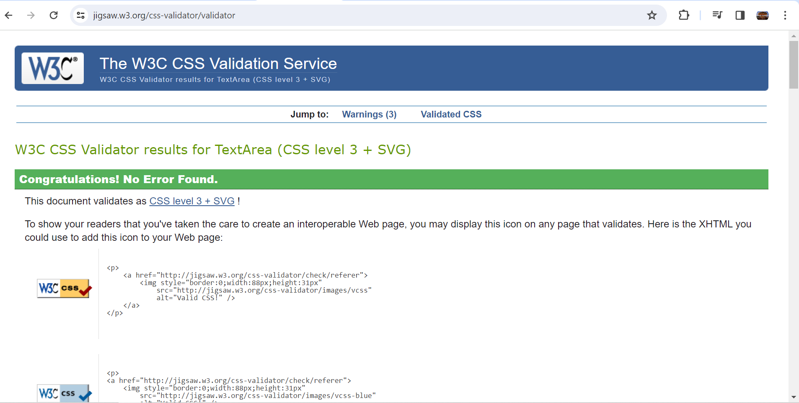

<h1 align="center">Project 1 - Book Club Website</h1>

[View the live project here.](https://a-dan-a.github.io/book-club/)

This is a website for a fictional book club that meets monthly and in person. It has been designed to be responsive on all devices, making navigation easy for anyone who wishes to find out more about the book club. The site is for anyone who might wish to join a book club and gives information enough to tell them about the club, the books and the people as well as giving them a chance to contact the club. This should be welcoming and informative to different types of users.

<h2 align="center"></h2>

## User Experience (UX)

-   ### User stories

    -   #### First Time Visitor Goals

        1. As a First Time Visitor, I want the purpose of the site to be obvious and the information to be relevant and useful.
        2. As a First Time Visitor, I want the navigation to be obvious and easy.
        3. As a First Time Visitor, I want to see testimonials to understand what current users get out of the book club.

    -   #### Returning Visitor Goals

        1. As a Returning Visitor, I want to see what the club has been doing.
        2. As a Returning Visitor, I want to be able to easily find a way to contact the club to find out more information.
        3. As a Returning Visitor, I want to be able to find links to social media.

    -   #### Frequent User Goals
        1. As a Frequent User, I want the information to be relevant and up-to-date.
        2. As a Frequent User, I want there to be features that can be regularly updated so I have a reason to come back.
        3. As a Frequent User, I want the site to be welcoming and make me want to connect with the club.

-   ### Design
    -   #### Colour Scheme

The main colors used are: 

| Color | Hex Code |
| :---: | :---: |
| white | #ffffff |
| grey | #a7a7a7 |
|dark red  | #be3144  | 
        
with Black - #000000 text.

-   #### Typography
    -   The Arial font is used throughout the site, with Helvetica and sans-serif as back-ups in case there is an error. Arial is a highly accessible and clean font that makes the site easy to read.
 -  #### Imagery
    -   Images are important, and a background hero image has been used on the index page to convey the theme of books to users. Other images have been used to enhance this theme.

*   ### Wireframes

    -   #### Desktop wireframes

        

        
        
        

 

    -   #### Mobile Wireframe 

        

        

        

    -   #### Tablet Wireframe

        

        

        

## Features

-   Is responsive on all screen sizes.

-   Embedded YouTube video of a relevant book club discussion.
-   Has a navigation bar with links.

-   Has a footer bar with social media links.
-   Has a form to contact the club with a button.

-   The form button takes the user to a thanks page to show they have successfully submitted       their details.

-   Has reviews of books from other book club members.

-   Has a list of books that have been read last year and will be read this year.

-   Has details of the meeting places, date and time.
-   Has details of which books are coming up next to be read.

## Technologies Used

### Languages Used

-   [HTML5](https://en.wikipedia.org/wiki/HTML5)
-   [CSS3](https://en.wikipedia.org/wiki/Cascading_Style_Sheets)

### Frameworks, Libraries & Programs Used

1. [Bootstrap 4.2.1:](https://getbootstrap.com/docs/4.4/getting-started/introduction/)
    - Bootstrap was used to assist with the responsiveness and styling of the website.
1. [Font Awesome:](https://fontawesome.com/)
    - Font Awesome was used for the social media icons in the footer of every page.
1. [jQuery:](https://jquery.com/)
    - jQuery came with Bootstrap to make the navbar responsive but was also used for the smooth scroll function in JavaScript.
1. [GitPod](https://gitpod.io/)
    - GitPod was used as the code editor for this project, to control version control and pushing to the repository.
1. [GitHub:](https://github.com/)
    - GitHub has been used to store the project.
1. [Paint:](https://www.microsoft.com/en-us/windows/paint)
    - Paint was used to create the [wireframes]() that were used in the design process.

## Testing

The W3C Markup Validator and W3C CSS Validator Services were used to validate every page of the project to ensure there were no syntax errors in the project.

_____

### Testing User Stories from User Experience (UX) Section

-   #### First Time Visitor Goals

    1. As a First Time Visitor, I want the purpose of the site to be obvious and the information to be relevant and useful.

        1. Upon entering the site, the user will see the callout welcoming them and explaining in a sentence what the book club is about.
        2. The hero image and embedded video show clearly what the site is about.
        3. The user can scroll down and see more information, including meeting dates and times and a summary of what the book club will be reading next.
    
    

    2. As a First Time Visitor, I want the navigation to be obvious and easy.

        1. The site is designed to be simple and easy, there is a navbar at the top, and scrolling down will show you all the information you need.
        2. Each page has an obvious purpose, such as an overview of the club, more details and reviews, and a way to contact the club.
        3. On the contact page, once you have submitted your details, you will be redirected to a friendly thank you page so you know it has worked. A simple button navigates you back, or you can use the nav bar.
    

    3. As a First Time Visitor, I want to see testimonials to understand what current users get out of the book club.
        1. After reading an overview of what the book club is about, the next page will show more information, including reviews by members.
        2. The user can scroll down to the bottom of every page to find social media links to find out more about the club.
        3. On the home page there is a Youtube video that demonstrates what a book club is like, using a recently read book.
    

-   #### Returning Visitor Goals

    1. As a Returning Visitor, I want to see what the club has been doing.

        1. This is shown clearly on the about page, with a list of recently read books.
        2. At the bottom of every page are social media links to see more about the recent activities of the club.
    
    

    2. As a Returning Visitor, I want to be able to easily find a way to contact the club to find out more information.

        1. There is a link to the contact page in the nav bar.
        2. On this page, they can fill out a form to find out more about the club.
        3. The footer contains social media links for the club, where it would be possible to message them.
        4. All the social media links open in a new tab, so the user can continue browsing on the site easily.
    
    

    3. As a Returning Visitor, I want to be able to find links to social media.
        1. The social media links are at the bottom of every page.
        2. All the social media links open in a new tab, for ease of use.
    

-   #### Frequent User Goals

    1. As a Frequent User, I want the information to be relevant and up-to-date.

        1. The Home page has the up-to-date meeting details for the group.
        2. There is also a list of the next 4 books that the group will read.
        3. On the About page, there is a list of books that were read in the previous year and that will be read in the current year, meaining that there is always plenty of relevant information for the user to browse.
    
    

    2. As a Frequent User, I want there to be features that can be regularly updated so I have a reason to come back.

        1. The upcoming books will be updated every month.
        2. There are reviews of recently read books on the About page that will be updated often.
    
    

    3. As a Frequent User, I want the site to be welcoming and make me want to connect with the club.
        1. All of the text is designed to be friendly, welcoming and not too formal.
        2. The site contains reviews by users to show what people are like at the club.
    
    

### Further Testing

-   The website was tested on Google Chrome and Microsoft Edge browsers.
-   The website was viewed on a laptop and a smartphone as well as by using chrome developer tools to test different screen sizes.
-   Testing was done to make sure all of the pages linked to each other and to any external links properly.

-   Testing was done with Google's Lighthouse devtool. The index page scored lower in performance and best practices because of issues relating to the embedded Youtube video.

-   Testing was done with the Webaim WAVE tool to test accessibility

### Known Bugs

-   The footer was oriented to one side of the page. This was fixed by removing 'inline-block' from the CSS.

-   Form attribute types were flagged as wrong by the validator. These had not had the attributes changed from the original Bootstrap code and this was fixed.

-   Fixed CSS not working by adding scripts to each page.
    
        
        
        

-   Fixed background image on main page. The file path was wrong and google devtools was used to investigate the problem, perform online edits to test out solutions and then apply the solutions to the code.

        From:     
        background: url('/assets/images/bookcase.jpg') no-repeat bottom right fixed;
    
        To:
        background: url('assets/images/bookcase.jpg') no-repeat bottom right fixed;

-   Fixed broken image links in README by amending the filepath.

        From:
        
        
        To:
         

-   Fixed form validation issue by removing 'onclick' from code.

        From:
        <button type="submit" class="btn btn-primary" onclick="window.location.href='thankyou.html'">Submit</button>
        
        To:
        <button type="submit" class="btn btn-primary">Submit</button>

## Deployment

### GitHub Pages

The project was deployed to GitHub pages using the following steps:

1. Log into [GitHub](https://github.com/)
2. Navigate to this [repository](https://github.com/A-Dan-A/book-club/).
3. Go to settings and select pages.
4. Select 'deploy from a branch' and 'main' as the root.
5. There should now be a link to the published website once it is ready.

### Forking the GitHub Repository

By forking the GitHub Repository a copy of the original repository is made, so we can make changes without the original being changed.

1. Log in to GitHub and locate the [GitHub Repository](https://github.com/)
2. At the top of the Repository,above the "Settings" Button on the menu, locate the "Fork" Button.
3. A copy of the original repository should now be in your account.

### Making a Local Clone

1. Log in to GitHub and locate the [GitHub Repository](https://github.com/)
2. Click "Clone or download", which are underneath the repository name.
3. Copy the link under "Clone with HTTPS" and this will clone the repositor using HTTPS.
4. Open Git Bash
5. Change the current working directory to the location where you want the cloned directory to be made.
6. Type `git clone`, then paste the URL that you copied in Step 3.
7. Press Enter, and your local clone will be created.

## Credits

### Code

-   [Bootstrap4](https://getbootstrap.com/docs/4.2/getting-started/introduction/): Bootstrap code was used on all pages to make a responsive website that was well presented and easy to use.

-   The code for the callout on the index page partially came from the Bootstrapping Your Next Big Idea With Bootstrap 4 section of the course, specifically the [WhiskeyDrop Website](https://github.com/Code-Institute-Solutions/BootstrappingYourNextBigIdea-BS4) but was modified and streamlined for my own needs.

-   The code for the upcoming books section on the index page came from the Love Running [Love Running](https://github.com/Code-Institute-Solutions/love-running-v3) section of the course and was modified for the needs of the website.

### Content

-   All the content was written by the developer.

-   The template used for the README was from a Code Institute [sample README](https://github.com/Code-Institute-Solutions/SampleREADME) that was rewritten for this specific project, but with some content retained or modified where it was used, such as credits for Bootstrap.

### Media

-   Bookshelf background image and front cover pictures are by the developer.

-   Upcoming books background image from Wikimedia Commons of a [library behind a doorway](https://upload.wikimedia.org/wikipedia/commons/thumb/7/70/Bredevoort_%28NL%29%2C_Antiquariat_--_2018_--_1836.jpg/640px-Bredevoort_%28NL%29%2C_Antiquariat_--_2018_--_1836.jpg)

### Acknowledgements

-   My Mentor for their patience and help in problem solving and guiding me in what worked and what needed to be added or changed.

-   Tutor support at Code Institute for their support and helpful advice.